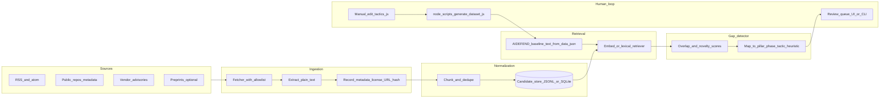

Notes - AIDEFEND Discovery Layer

> Status (2026-05-03): Original architecture sketch, kept for provenance. Prototype landed in this repo (`aidefend-discovery`); current state lives in `.ai/CURRENT.md` and `docs/aidefend_discovery/ROADMAP.md`.

**Structured layer** — The existing framework of collected information: defenses, threats, mappings, etc. (the current framework).

**Discovery layer** — Observation of real-world signals (repos, configs, model cards, incident feeds, etc.) not yet ingested in the structured layer; emits **candidates** with confidence and citation for possible promotion.

**Gap** — A discovery item the frameworks do not currently cover.

Get the rough architecture and concept down first, then scaffold the project and run it.

Data
- Correlation Engine, how does a new finding be ingested and relationized to existing data to fit into the framework?
  - Data Quality, WHAT you ingest (trusted sources vs bad blogs), HOW you store it (citations and evidence), and HUMAN REVIEW.
  - Lexical relationship, text gets broken into tokens (running -> run) and compares overlap between those mathematical values, this can allow for common topics to be found since they use similar words.
  - BM25 (Lexical Scorer), it ranks common lexical pairs found via things like good is more (more common words = stronger connection), and rare words have more impressive connection scoring (i.e both say Linux > both say the)
    - Cheap, static, simple
  - Embeddings, turns text to vectors (a list of numbers) that captures meaning not just spelling. Measure similarity via vectors via cosine similarity, two sentences can score high if they use diff words but talk about the same thing. 
    - Complex, abstracted, required models (neural networks)
  - Explicit bridges, deterministic connections, specific IDs (CVEs with ID number, prodcut names, etc). These are specific items that can be associated to things
  - Ranked hypotheses + explainability, not just a score but ranks them, this candidate probably relates to A first, B second, C third, because of x and x.
- APIs for Quality Data Sources, heavily driver quality WHAT you ingest, looks like NIST NVD (National Vulnerability Database) API that gives immediate CVEs queryable as they come out etc. 

---

## 1. Executive summary (≤120 words)

AIDEFEND already excels as **curated, mapped defense intelligence**. The gap is **open-world novelty**: real attacks, vendor patterns, and research move faster than finite frameworks. This R&D adds a **discovery layer**: ingest permissively licensed/public signals, normalize into **cited candidate** threats/surfaces, retrieve against the existing technique corpus (`data/data.json`), and flag gaps where coverage is weak or absent—feeding a **human review queue** before any promotion into `tactics/*.js`. The founder-aligned hypothesis is **structured baseline + continuous discovery**, not replacing the open KB with an opaque scraper.

## 1.5 Frame the idea (problem, solution, behavior)

**Problem:** Teams using static taxonomies alone ship blind spots; mapping-only tools cannot surface novel threats or uncatalogued attack surfaces.

**Solution:** Pair the existing AIDEFEND structured corpus with **evidence-backed discovery** that proposes additions and measures overlap with current techniques/threat mappings.

**Behavior:** Ingestion produces candidates with citations and confidence; a **gap detector** compares candidates to the baseline; maintainers triage and optionally edit `tactics/` + run `node scripts/generate-dataset.js`.

## 2. Product hypothesis (one paragraph)

**Who benefits:** Framework maintainers (prioritize backlog), defenders integrating AIDEFEND into SOC/architecture (early warning), and downstream MCP/RAG consumers (richer “unknown unknown” surfacing if wired carefully).

**Faster/safer decisions:** Faster prioritization of what to add or remap; safer operations when discovery is framed as **hypothesis + citation** rather than ground truth.

**What goes wrong if naive:** False positives burn reviewer trust; taxonomy drift forks language away from OWASP/MAESTRO/NIST IDs; licensing violations from ingesting non-open text; prompt injection or malicious docs in feeds; confusing candidates with approved techniques in UX/API.

### Success metrics (initial)

- **Coverage signal:** % of candidates that resolve to existing technique/threat mapping above a similarity threshold (segment “already covered”).
- **Reviewer throughput:** Median time to accept/reject a candidate; reject reasons tagged (duplicate / low quality / license / out of scope).
- **Gap quality:** Accepted gaps that later appear in external frameworks or incidents (lagging validation).
- **Safety:** Zero promoted rows without provenance; candidate API **never** mutates `data/data.json` automatically.

## 3. Minimal system design

### Concrete schemas / interfaces (minimal)

- **`CandidateFinding` (JSON):** `{ id, status: candidate|rejected|promoted, title, summary, source_urls[], retrieved_at, license_note, confidence, raw_hash }`
- **`GapReport` (JSON):** `{ candidate_id, nearest_technique_ids[], max_similarity, suggested_tactic_pillar_phase[], rationale }` — nearest IDs must reference existing **AID-\*** IDs from baseline.
- **`Retriever interface`:** `embed(text) -> vector` **OR** `lexical_search(query) -> ranked_chunks`; implementation swappable.

**Separation:** Approved truth stays in repo tactic modules + generated JSON; discovery DB is ephemeral or gitignored in early prototypes.

### Integration touchpoints (existing repo)

**Read-only baseline:** Load technique names, descriptions, `defendsAgainst` from generated `data/data.json` (or parse tactic sources if you need HTML stripped consistently—the generator centralizes output).

**Optional downstream:** New MCP tool(s) could mirror `webmcp-tools.js` patterns but only expose **candidates** when explicitly invoked, distinct from “official” technique tools—avoid blending namespaces without versioning.

## Prioritized backlog (small team)

- **Baseline loader module** — Flatten **AID-\*** records + threat mapping strings from `data/data.json` for retrieval.
- **Candidate store + CLI** — Append-only JSONL, status transitions, audit fields.
- **Single-source connector** — One low-risk feed (e.g. public security blog RSS or NVD/CVE keyword filter for AI-related entries) with robots/terms respect.
- **Gap detector v0** — Lexical BM25 or small embedding model; output top-k technique hits + `no_match` flag.
- **Reviewer workflow** — Minimal TUI or spreadsheet export; mandatory citation preview.
- **Promotion playbook** — Doc linking candidate → which `tactics/*.js` technique object shape to extend (follow existing tactic file patterns).
- **Guardrails** — License classifier stub; block ingestion domains not on allowlist.

## One thin vertical slice (implement next)

**Slice:** “RSS → Candidate → Gap vs AIDEFEND” without UI or auto-promotion.

1. Fetch one **allowlisted** RSS (AI security tagged).
2. Extract title + summary + link; write **`CandidateFinding`** JSONL.
3. Load baseline from checked-in `data/data.json`.
4. Run **BM25** (no GPU) to retrieve top 5 **AID-\*** techniques; emit **`GapReport`** when max score is below threshold or no threat-ID overlap heuristic.
5. **Output:** `reports/gap_run_YYYYMMDD.json` (or equivalent under your R&D repo’s `reports/`).

This validates plumbing, citation discipline, and reviewer usefulness before embeddings or multi-source scale.

**Prototype home (decided):** `aidefend-discovery` repo (this one) — keeps the AIDEFEND framework repo clean and gives CI coupling to upstream tags via the explicit promotion playbook.

## Open questions / assumptions (founder or maintainer input)

**Scope of ingestion:** Which sources are acceptable by policy (RSS only vs GitHub API vs paid feeds)? **Suggested baseline catalog:**

- **Framework anchors (AIDEFEND already maps)** — Ingest official, versioned artifacts (pages, PDFs, JSON where MITRE/others publish machine-readable data): **MITRE ATLAS**, **OWASP** LLM / ML / Agentic Top 10s, **MAESTRO**, **NIST** adversarial ML guidance, **Google SAIF**, **Databricks DASF**, **Cisco** AI security framework. Taxonomy anchors and regression baseline when discovery proposes “new” threats.
- **MITRE CTI-style feeds** — Stable IDs and relationships (ATLAS tactics/techniques; **ATT&CK** for adjacent infra if bridging). Official APIs/downloads only.
- **CVE / NVD** — Ground truth for vuln-shaped facts; **CISA KEV** when relevant. Filter/score for ML/AI-adjacent products (inference servers, notebooks, agent frameworks, GPU stacks, supply-chain libs).
- **Vendor / cloud AI advisories** — Hyperscaler + AI lab security/trust/incident pages and RSS/APIs where available.
- **OSS GitHub Security Advisories** — ML/agent stacks (e.g. LangChain, LlamaIndex, vLLM, gateways). Concrete versions, CWE-class issues.
- **Standards / regulators** — ISO/IEC, **NIST AI RMF**, EU AI Act implementation guidance where they encode control expectations.
- **Academic / preprints** (e.g. arXiv cs.CR) — High variance; **candidate intel only** unless corroborated.
- **Bug bounty aggregations** — Noisy; occasional leads.

**Taxonomy authority:** When a candidate conflicts with OWASP/NIST wording — **AIDEFEND is canonical** for phrasing; mirror upstream **IDs** where applicable.

**Product surface:** Should candidates appear on aidefend.net, only in MCP, or a separate **Labs** property (aidefendlabs.com)?

**Operational boundary:** Overlap threshold tuning — **community-contributed**; do as much productive work as useful; may become an entirely separate project.

**Relationship to aidefend-mcp:** **Extend the MCP** with optional discovery tools and strict labeling.
